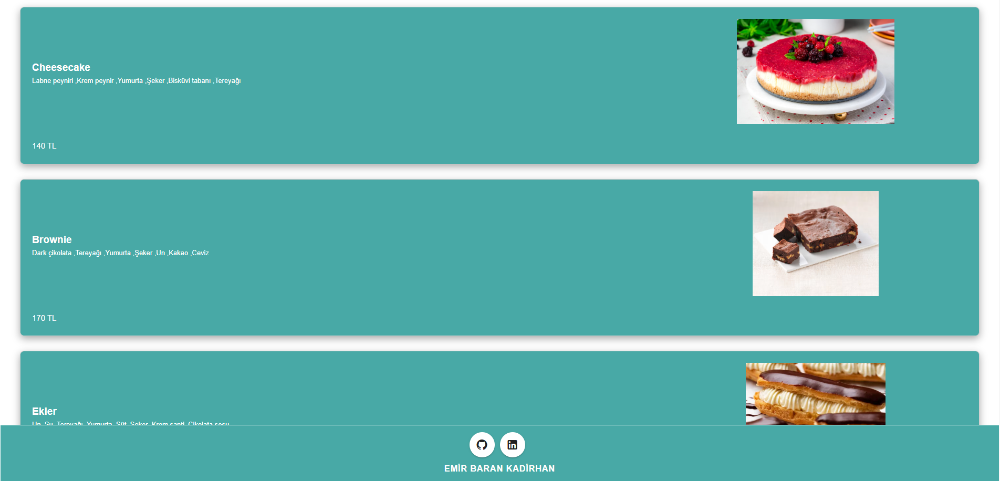

# Restaurant-Menu-Uygulaması


## Proje Açıklaması
Bu uygulama, kullanıcıların menüdeki yemekleri görüntülemesini, yemeklerin detaylarını incelemesini ve etkileşimli bir deneyim yaşamasını sağlar. Proje, JSON Server ile senkronize edilerek dinamik veri yönetimi sunar.


## Proje Açıklaması
- **Vue.js**: Kullanıcı arayüzünü oluşturmak için modern JavaScript framework'ü.
- **JSON Server**: API benzeri veri yönetimi ve test için kullanılan bir Node.js paketi.
- **HTML/CSS**: Uygulamanın temel yapı ve tasarımını oluşturur.
- **JavaScript**: Uygulamanın işlevselliğini sağlamak için.


## Ekran Görüntüsü





## Kurulum 
1. Gerekli bağımlılıkları yüklemek için:
   ```bash
   npm install
   ```
2. Uygulamayı geliştirme modunda çalıştırmak için:
   ```bash
   npm run serve
   ```
3. JSON Server'ı Çalıştırmak İçin:
   ```bash
   json-server --watch data/db.json
   ```
4. Gerekli Ek Kütüphanelerin Yüklenmesi:
   ```bash
   npm install vuetify
   npm install vue-carousel
   ```

## Katkıda Bulunma
Eğer bu projeye katkıda bulunmak istiyorsanız, lütfen bir pull request göndermeden önce issue oluşturun ve önerilerinizi paylaşın.


